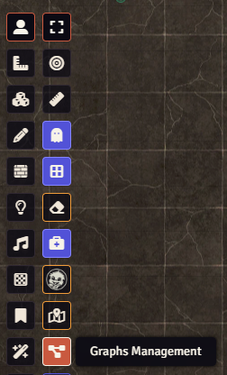
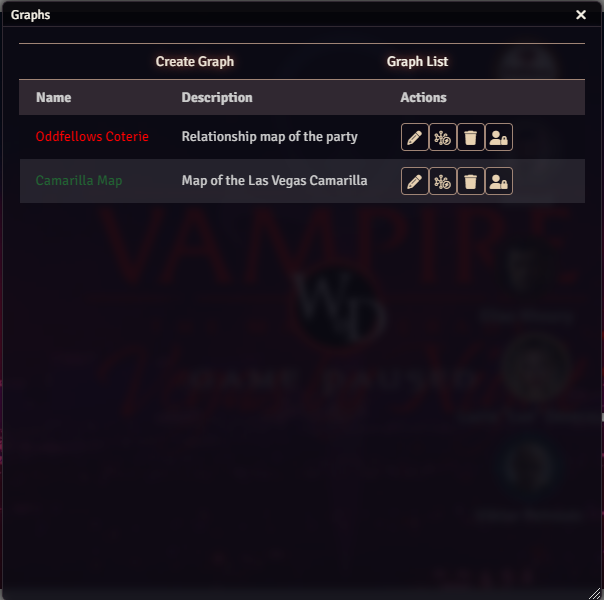
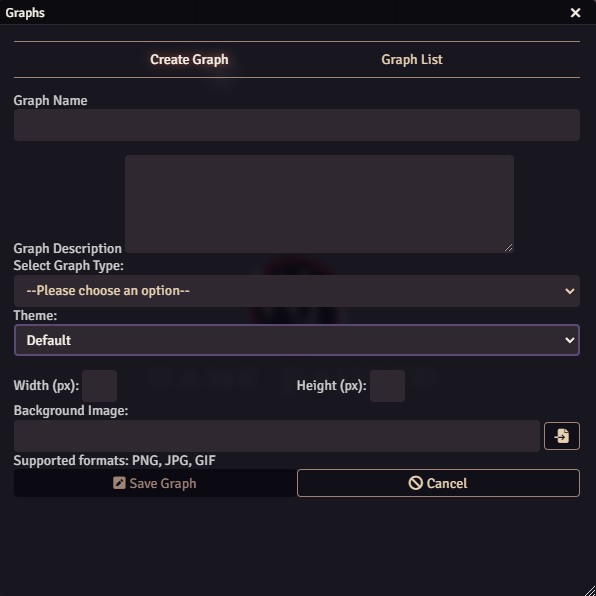
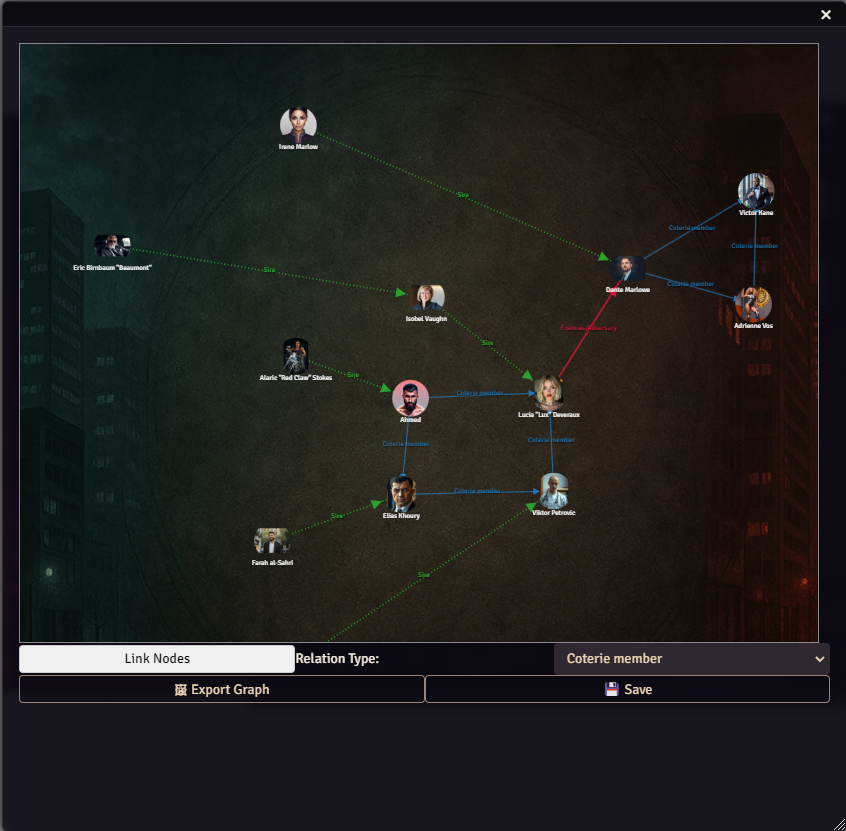

- 
- 
- 
- 

# Foundry Graph - Visual Relationship Mapping

# !!! WARNING !!! - this module is still in beta mode until this comment is removed.  Use it to test its features and give feedback, but do not manage real data, the development is at early stage: metadata will change and there will be no migration path for graphs created.

Draw the threads that connect your world. Turn relationships into stories you can see.
Visualize lineage, alliances, and secrets in living diagrams with ease.

Foundry Graph is a powerful and intuitive module that lets you visually map relationships between actors, scenes, items, or any other entity in your world. Whether you're managing political intrigue, faction conflicts, character connections, or ancient bloodlines, this tool gives you a dynamic canvas to build, edit, and explore complex networks.
You can choose between a set of graph types and create your **relation map**

| Graph type | Renderer    | System    | Object Allowed | Description                                                                          |
| ---------- | ------- | ------------ | ---- | -------------------------------------------------------------------------- |
| Enemy Map | Free Diagram| any | Actors | A diagram to represent better relationship with enemies |
| World of Darkness Relationship Map | Free Diagram    | WoD5e, Vtm5e, worldofdarkness   | Actors | The relationship map for a coterie or a single character, with dedicated relations for the World of Darkness system   |
| Faction Power Structure | Free Diagram | any | Actors | A diagram with relations useful for mapping the internal hierarchy of a faction |
| Characters Map   | Free Diagram  | any   | Actors | The classical map between generic Actors  |
| Genealogy Tree  | Genealogy | any | Actors | Genealogical tree for Actors only |

New graph types are cooking, add an issue if you would like to have a specific graph type.

In this initial phase of the module the goal is to confront with the users and define a good set of relations for each graph type and create together the graph types that are needed.

✨ Features
- **Interactive Graph Builder**: with drag-and-drop node placement and zoom/pan support.
- **Custom Graph Types**: (e.g., "Enemy Map", "Coterie Web", "Political Factions").
- **Relation Styling**: Each relationship type can have a unique color, line style, and width (e.g., dashed red for "Enemy", dotted green for "Ally").
- **Link & Node Management**: Easily link or unlink entities or delete nodes.
- **Background Support**: Set a background image for your graph to anchor it in a visual context (maps, floor plans, etc.) [at the moment linked to the graph type, but planned to make it custom].
- **Persistent Storage**: Graphs are saved and managed per world, supporting editing, exporting, and rendering as SVG.
- **Export of Diagram**: Graphs can be exported as PNG. The VtM Relationship Map below is an example
- **Open Sheet from Graph**: it is possible to open the sheet of the Document in the graph by double clicking on the node.

# Usage
You will find the **Graph Management** button in the Token toolset.

The button will open 
the **Graph Dashboard** with the list of the existing graphs on the world.

The **Create Graph** tab allows you to create a new graph or to edit an existing one.

Each graph type comes with a predefined background; the option of managing a custom background image for a graph is under construction.

By pressing the **Open Graph** button in the list view it will be possible to manage the graph.

The way of building a graph diagram differs slightly between graph types:
- Genealogy types: cannot have dangling nodes so - apart the first node - each node must be dropped once the **Link Nodes** button is activated and the dropped node will get the relation - chosen in the select list - with the clicked node.
- Free Diagrams types: nodes can be placed on the diagram as please and all type of entities can be dropped (Actors, Items, Scenes). Using the **Link Nodes** button it will be possible to draw links between nodes (the first clicked will be the source, the second the target). A left click on either the node or the link will allow deletion

🧩 Use Cases
- Track political alliances and betrayals in a Game of Thrones-style intrigue.
- Build a vampire lineage and coterie relationship web for World of Darkness.
- Visualize quest dependencies and how NPCs are tied to objectives.
- Map out interconnected factions in a sandbox world.

## Changelog

[Changelog](CHANGELOG.md)

## Planned features
- Custom background overloading the one proposed
- customization of the relations on a per graph base
- better link drawing: allow for splines of segmented links

## Support

Please open issues on this repo for any problems that you can have using this module.
For discussing on my modules please join my [discord server:](https://discord.gg/FgKtjFRn3e)

If you want to support this work

