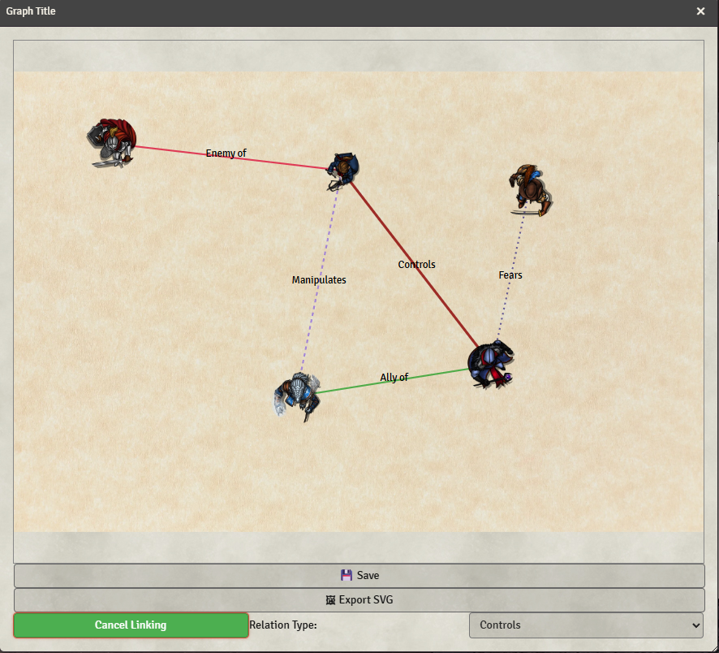

- 
- 
- 
- 

# Foundry Graph - Visual Relationship Mapping

> Draw the threads that connect your world. Turn relationships into stories you can see.
Visualize lineage, alliances, and secrets in living diagrams with ease.
Foundry Graph is a powerful and intuitive module that lets you visually map relationships between actors, scenes, items, or any other entity in your world. Whether you're managing political intrigue, faction conflicts, character connections, or ancient bloodlines, this tool gives you a dynamic canvas to build, edit, and explore complex networks.

## ⚠️ Beta Status

**Foundry Graph is currently in beta.**  
Schemas may change and migrations are not guaranteed yet.

Use for testing and feedback — not long‑term production data.

---

## Overview

**Foundry Graph** is a Foundry VTT module that allows Game Masters to build interactive visual graphs directly inside their worlds.

Create:

- Character relationship webs  
- Political or faction hierarchies  
- Vampire coteries and genealogies  
- Investigation boards  
- Geographic maps  
- Quest dependency diagrams  

Everything lives directly inside Foundry — no external tools.

## Quick Visual Tour

  
<strong>Relationship Mapping</strong>

  
<strong>Genealogy Map</strong>

  
<strong>Geographic Map Mode (Leaflet)</strong>

  
<strong>Slot Renderer</strong>

### Graph Editor

  
<strong>Graph Editor</strong>

### Graph Editor

## How the module works: Graph Types and Renderers

Foundry Graph is built around two core concepts:

### 1) Graph Types (templates)
A **Graph Type** defines the purpose of a graph and its rules:

- which Foundry entities can be dropped (Actors / Items / Scenes / Journal Pages)
- which relationship types exist (e.g. Ally, Enemy, Child-of…)
- optional themes and default background configuration
- which renderer is used to display and edit the graph

Graph Types let you offer “ready-to-use” experiences like *Vampire Relationship Map*, *Genealogy Tree*, or *Geographical Map*, while keeping a consistent data model across the module.

### Graph Types
Templates defining:
- allowed entities
- relations
- default background
- renderer choice

These are the graph type available 
| Graph Type | Renderer | Themes |System | Allowed Objects | Description |
|-----------|----------|---|-----|-----------------|-------------|
| Characters Map | Free Diagram | | Any | Actors | Generic character relationships |
| Enemy Map | Free Diagram | | Any | Actors | Conflict-focused diagrams |
| Faction Power Structure  | Free Diagram | | Any | Actors | Internal faction hierarchies |
| World of Darkness Relationship Map | Free Diagram | Modern, Old | WoD5e / VTM5e | Actors, JournalPages | Coterie and vampire relations |
| Genealogy Tree | Genealogy | | Any | Actors | Family or lineage trees |
| Geography Map (OpenStreetMap or Raster) | Leaflet | | Any | Any | Geographic markers |
| Haven Layout | Slot Layout | Castle, manor, house, modern house, condo, penthouse, slums, medieval village, medieval manor, medieval crypt| WoD5e / VTM5e | Items | Vampire haven visualization |

New graph types are actively under development — feel free to open an issue with suggestions.

### 2) Renderers (interaction engines)
A **Renderer** is the engine that controls:

- how the graph is displayed
- how users interact (dragging, linking, drawing, snapping to slots…)
- what is stored in the graph data (node positions vs lat/lng vs slot ids)

Renderers are reusable: multiple graph types can share the same renderer but differ in allowed entities and relation vocabulary.

#### Force Renderer (Free Diagram)
**Concept**
A diagram made of **nodes + links** on a 2D canvas. Nodes have manual positions and links have styles.

**Key interactions**
- Drag & drop Foundry documents to create nodes
- Manual positioning: nodes can be dragged anywhere - free placement
- Linking mode: enable “Link Nodes”, shift-click source → _drag_ → click target to create a relationship
- Add custom labels at _source_ or _target_ positions
- Relation styling: links can have color, width, and dashed/dotted styles depending on relation type
- Node actions:
  - Double-click opens the referenced document sheet
  - Deletion
  - Hiding the image/identity
  - For Journal Page nodes can customize the image

Best for relationship webs, investigations, factions.

#### Genealogy Renderer
**Concept**
A hierarchy layout driven by genealogy rules. Nodes must always be connected.

**Key interactions**
- Tree requires an initial root node - no dangling nodes
- Link-first workflow (no dangling nodes):
  - select an existing node
  - drop a new Actor to create a related person
- Relation types are constrained to genealogy semantics

Best for lineage, ancestry, bloodlines, structured “parent/child” trees.

#### Map Renderer (Leaflet)
**Concept**
A Leaflet-powered map supporting either OpenStreetMap tiles or a raster background image.

**Base layers**
1. OpenStreetMap (default)
2. Raster image (png/jpg/webp) using simple image coordinates

**Key interactions**
- Drag & drop documents to create markers
- Move markers to update coordinates
- Draw polygons, polylines, rectangles, circles

**Typical graph types**
Custom city maps, fantasy regions

Best for world maps, city maps, location-centric graphs.

#### Slot Layout Renderer
**Concept**
A background image contains predefined slots. Nodes snap into slots and follow validation rules.

Slots define:
- position and size
- capacity
- allowed document types

**Key interactions**
- Drag & drop documents onto slots
- Snap-to-slot placement
- Slot validation (deny if full or invalid type)
- Optional linking

Best for structured boards (havens, dashboards).

---

## Usage

Open **Graph Management** from the Token toolbar:

Dashboard:

Create / edit graphs:

Workflow:

1. Create graph
2. Open it
3. Drag documents
4. Link nodes
5. Save

---

## Planned Features
- Timeline renderer
  

## Changelog

[Changelog](CHANGELOG.md)

## Support

Please open issues on this repo for any problems that you can have using this module.
For discussing on my modules please join my [discord server:](https://discord.gg/FgKtjFRn3e)

If you want to support this work

